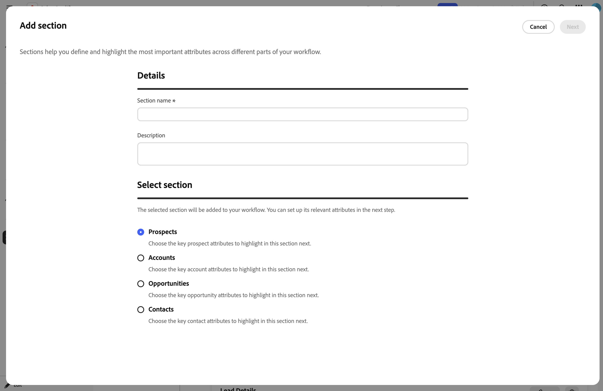

# Intégrations

Connectez Outlook pour envoyer des e-mails, reconnaître les réponses des prospects et planifier des réunions. Pour mettre les prospects, contacts, comptes, opportunités, activités et propriétaires à la disposition de Account Qualification Agent (AQA) et des workflows sortants, vous pouvez également connecter Sales Qualifier à Salesforce ou Microsoft Dynamics 365. Sales Qualifier lit les données CRM, peut écrire les activités de sensibilisation et le statut de désinscription dans le CRM et peut synchroniser les activités de sensibilisation avec Marketo. Il ne modifie pas les enregistrements CRM d’une autre manière.

Cet article explique comment connecter Outlook, gérer une connexion CRM, mapper des champs, synchroniser des activités et configurer le processus de désinscription aux e-mails. Pour connecter un CRM pour la première fois, voir [Prise en main](getting-started.md#connect-your-crm).

>[!IMPORTANT]
>
>La connexion Outlook est établie par représentant. Les paramètres CRM et de conformité décrits plus loin dans cet article s’appliquent à l’ensemble de l’organisation. Pour accéder à ces paramètres à l’échelle de l’organisation, vous devez appartenir aux groupes d’utilisateurs `Sales Qualifier` et `Sales Qualifier Admins`. Les utilisateurs standard peuvent utiliser les données et les filtres CRM configurés, mais ne peuvent pas modifier les paramètres.

## Connecter Outlook

Chaque représentant connecte son propre compte Outlook :

1. Sélectionnez **[!UICONTROL Connecter Outlook]**.
1. Connectez-vous avec votre compte Microsoft.
1. Examinez et approuvez l’accès demandé.

La connexion permet à Sales Qualifier d’envoyer des messages depuis votre boîte aux lettres, de reconnaître le moment où un prospect répond et de planifier des réunions dans votre calendrier.

Lorsque vous vous connectez, vous approuvez l’accès qui permet à Sales Qualifier de :

* Reconnaître les réponses des prospects.
* Créer et envoyer un e-mail en votre nom.
* Utilisez votre calendrier pour planifier des réunions.
* Lisez le fuseau horaire et les heures de travail de votre boîte aux lettres pour la planification.
* Restez connecté automatiquement afin que ces fonctionnalités continuent à fonctionner sans que vous ayez à vous reconnecter.

### Validations Outlook (si nécessaire)

Par défaut, aucune action de l’administrateur n’est requise. Chaque représentant approuve l&#39;accès pour lui-même lorsqu&#39;il se connecte à Outlook.

Si votre organisation a désactivé le consentement des utilisateurs pour les applications tierces dans Microsoft 365 ou Microsoft Entra, un administrateur Microsoft 365 ou Entra doit approuver Sales Qualifier une seule fois pour l’ensemble de l’organisation. L&#39;administrateur termine cette approbation avant que les représentants ne connectent leurs comptes Outlook. Après l’approbation à l’échelle de l’organisation, chaque représentant peut connecter son compte.

### Gestion des données de boîte aux lettres par Sales Qualifier

Sales Qualifier lit uniquement les réponses aux e-mails qu’il a envoyés, et non le reste de votre boîte de réception. Il ne stocke pas les pièces jointes ou les e-mails entrants en dehors d’un engagement actif. Les informations d’identification de connexion stockées sont chiffrées.

## Ouvrir les paramètres CRM

Dans le volet de navigation de gauche, développez **[!UICONTROL Administration]** et sélectionnez **[!UICONTROL Paramètres d’administration]**. Les paramètres sont organisés en deux groupes :

| Groupe | Éléments |
| --- | --- |
| **[!UICONTROL Intégrations]** | **[!UICONTROL Connexions CRM]**, **[!UICONTROL Centre de connaissances]** |
| **[!UICONTROL Conformité]** | **[!UICONTROL Paramètres de messagerie]** |

Pour le centre de connaissances, consultez le guide [Créer un centre de connaissances](admin-settings.md#knowledge-center).

## Gestion des connexions CRM

Sélectionnez **[!UICONTROL Connexions CRM]**. La page contient des cartes pour **** et **[!UICONTROL Microsoft]** (Microsoft Dynamics 365). Chaque carte présente l’un des statuts suivants :

| Statut | Signification |
| --- | --- |
| **[!UICONTROL Connecté]** | La connexion est active et authentifiée. |
| **[!UICONTROL Inactif]** | Aucune connexion n&#39;est configurée pour ce CRM. |
| **[!UICONTROL Autorisations requises]** | La connexion est authentifiée, mais les portées requises sont manquantes. La carte répertorie les portées manquantes. |

>[!NOTE]
>
>Un seul CRM peut être actif à la fois. Lorsqu’un CRM est connecté, l’autre carte est désactivée. Déconnectez le CRM actif avant d’en connecter un autre.

Une carte non configurée affiche **[!UICONTROL Connect]**. Une carte configurée affiche **[!UICONTROL Gérer]** et un menu **[!UICONTROL Plus]** avec **[!UICONTROL Modifier la configuration]** et **[!UICONTROL Déconnecter]**.

### Connexion ou modification d’une connexion

1. Sur la carte CRM, sélectionnez **[!UICONTROL Se connecter]** ou sélectionnez **[!UICONTROL Plus]** > **[!UICONTROL Modifier la configuration]** pour mettre à jour une connexion existante.
1. Saisissez les informations d’identification de votre administrateur CRM.

   >[!BEGINTABS]

   >[!TAB Salesforce]

   Saisissez les valeurs **[!UICONTROL ID client (clé du client)]** **[!UICONTROL URL de l’instance]** et **[!UICONTROL secret client]**. Utilisez le `https://{{mydomain}}.my.salesforce.com` de formulaire d’URL d’instance canonique.

   {width="800" zoomable="yes"}

   >[!TAB ]

   Saisissez les valeurs **[!UICONTROL ID client (clé du client)]** **[!UICONTROL ID client]**, **[!UICONTROL URL de l’instance Microsoft Dynamics]** et **[!UICONTROL secret client]**. Utilisez le `https://{{mydomain}}.crm.dynamics.com` de formulaire d’URL d’instance canonique.

   >[!ENDTABS]

1. Sélectionnez **[!UICONTROL Connexion]** (ou **[!UICONTROL Enregistrer]** lors de la modification).

Si Sales Qualifier rejette les informations d’identification, il identifie la cause, telles que des informations d’identification non valides ou expirées, des autorisations manquantes ou un client Dynamics non reconnu. Corrigez la valeur et réessayez.

>[!IMPORTANT]
>
>N’envoyez pas de secrets clients par e-mail. Utilisez le canal sécurisé approuvé de votre organisation pour partager des informations d’identification avec toute personne qui les saisit dans Sales Qualifier.

### Déconnecter une connexion

1. Sur la carte CRM connectée, sélectionnez **[!UICONTROL Plus]** > **[!UICONTROL Déconnecter]**.
1. Vérifiez l’avertissement et sélectionnez **[!UICONTROL Déconnecter]** pour confirmer.

>[!WARNING]
>
>Lorsque vous déconnectez un CRM, les workflows sortants sont suspendus pour tous les prospects de votre organisation et aucun nouveau prospect ne se synchronise à partir de votre CRM jusqu’à ce que vous vous reconnectiez.

## Mappage des champs CRM (mapping entrant) {#map-crm-fields-inbound-mapping}

Le mappage entrant contrôle les champs CRM que Sales Qualifier importe et où ils apparaissent. Les champs sont regroupés en sections, chaque section appartenant à un type d&#39;entité.

{width="800" zoomable="yes"}

1. Sur la carte CRM connectée, sélectionnez **[!UICONTROL Gérer]**.
1. Dans l’onglet **[!UICONTROL Mappage entrant]**, sélectionnez **[!UICONTROL Ajouter une section]**.

   {width="800" zoomable="yes"}

1. À l’étape **Sélectionner une section**, choisissez le type d’entité, puis sélectionnez **[!UICONTROL Suivant]** :

   | Entité | Où ses champs apparaissent |
   | --- | --- |
   | **[!UICONTROL Prospects]** | Onglet **[!UICONTROL Personne]** d’un prospect. |
   | **[!UICONTROL Contacts]** | Enregistrement du contact. |
   | **[!UICONTROL Comptes]** | Onglet **[!UICONTROL Compte]**. Voir [Comptes](accounts.md). |
   | **[!UICONTROL Opportunités]** | Détails de l’opportunité du compte. |

1. Saisissez un **[!UICONTROL Nom de section]** et un **[!UICONTROL Description]** facultatif. Sélectionnez ensuite **[!UICONTROL Suivant]**.
1. À l’étape **[!UICONTROL Ajouter un champ]**, recherchez et sélectionnez les champs du CRM à importer. Sélectionnez ensuite **[!UICONTROL Suivant]**. Chaque champ affiche ses **[!UICONTROL Nom d’affichage]**, **[!UICONTROL Nom du champ]** et **[!UICONTROL Type de données]**.
1. Pour les sections **[!UICONTROL Prospects]**, **[!UICONTROL Contacts]** et **[!UICONTROL Opportunités]**, activez **[!UICONTROL Filtrable]** pour chaque champ dont les représentants ont besoin dans la liste [Prospects](prospects.md).

   Un champ ne peut pas être filtré si son type de données ne prend pas en charge le filtrage ou s’il est déjà utilisé dans une autre section.

   Dans **[!UICONTROL Mes contacts d’opportunité]**, les champs d’opportunité filtrables s’affichent sous la forme de colonnes distinctes avec des libellés tels que **[!UICONTROL Étape (opportunité)]**. Le suffixe distingue les attributs d’opportunité des champs du contact associé.

1. À l’étape **[!UICONTROL Aperçu]**, confirmez votre sélection et sélectionnez **[!UICONTROL Ajouter]**.

Pour modifier une section ultérieurement, sélectionnez **[!UICONTROL Modifier]** sur la vignette de section. Pour supprimer une section, sélectionnez **[!UICONTROL Supprimer]** sur la vignette de section. Pour supprimer un champ individuel, sélectionnez l’action de suppression dans la ligne de champ. Confirmez chaque suppression.

## Configuration de la synchronisation des activités (mapping sortant) {#configure-activity-sync-outbound-mapping}

La synchronisation des activités écrit les activités de sensibilisation Sales Qualifier dans votre CRM et Marketo. Les activités E-mail envoyé, ouvert, sur lesquelles l’utilisateur a cliqué et a répondu incluent le nom du workflow sortant. Les représentants peuvent voir les activités dans le CRM, tandis que les équipes marketing peuvent utiliser les activités Marketo dans la notation des prospects et les calendriers d’engagement.

1. Sur la carte CRM connectée, sélectionnez **[!UICONTROL Gérer]**.
1. Ouvrez l’onglet **[!UICONTROL Mappage sortant]**.
1. Activez **[!UICONTROL Synchronisation des activités]**. Le paramètre est enregistré immédiatement.

Lorsque la synchronisation des activités est désactivée, Sales Qualifier continue à utiliser les données CRM entrantes, mais ne synchronise pas les activités de sensibilisation au CRM ou à Marketo.

>[!NOTE]
>
>La synchronisation des activités nécessite un accès en écriture dans votre CRM. Si l’autorisation requise est manquante, le commutateur est désactivé et Sales Qualifier vous invite à contacter votre administrateur. Pour octroyer l’accès en écriture aux activités, contactez votre administrateur CRM.

## Configurer les points forts marketing {#turn-on-marketo-engagement-filtering}

Les points forts marketing permettent aux représentants de trouver et de classer les prospects par engagement direct [!DNL Marketo], tel que les ouvertures d’e-mail et les clics. Voir [ Filtrer par points forts marketing ](prospects.md#filter-by-marketing-highlights).

Un administrateur effectue une configuration unique qui connecte [!DNL Marketo] à Sales Qualifier pour l’organisation et le sandbox appropriés. La configuration couvre la création d’informations d’identification d’API dans Adobe Developer Console, la configuration d’un webhook dans [!DNL Marketo] et l’ajout de ce webhook à un déclencheur Smart Campaign. Voir [Configurer les points forts marketing](marketing-highlights-setup.md) pour obtenir des instructions complètes.

Les points forts marketing sont disponibles dans toutes les régions de production : Amérique du Nord, EMEA et Australie.

## Configuration du processus d’opt-out global des e-mails {#configure-global-email-opt-out}

Le paramètre d’opt-out ajoute un pied de page de désabonnement à chaque e-mail sortant. Les utilisateurs standard ne peuvent pas la désactiver pour un e-mail individuel.

1. Dans le volet de navigation de gauche, développez **[!UICONTROL Administration]** et sélectionnez **[!UICONTROL Paramètres d’administration]**.
1. Sélectionnez **[!UICONTROL Paramètres de messagerie]** sous **[!UICONTROL Conformité]**.
1. Activez **[!UICONTROL inclure un lien d’exclusion dans chaque e-mail]**.
1. Dans **[!UICONTROL Modèle de message d’opt-out]**, saisissez le texte du pied de page. Incluez le jeton `{opt_out_link}` où le lien de désabonnement cliquable doit apparaître.

   Par exemple : `If you'd prefer not to receive these emails, you can {opt_out_link}.`

Le paramètre et le modèle sont enregistrés automatiquement.

Lorsqu’un prospect sélectionne le lien, Sales Qualifier cesse d’envoyer des e-mails à ce prospect et synchronise le statut d’opt-out avec le CRM connecté.

## Étendue de l’accès CRM

Sales Qualifier lit les entités CRM dont il a besoin et n’écrit qu’un ensemble défini de données :

* **Lecture**—Utilisateurs, contacts, mappages de propriétaires, prospects, comptes, opportunités et activités.
* **Écriture** : activités de sensibilisation consignées (lorsque [synchronisation des activités](#configure-activity-sync-outbound-mapping) est activé) et statut d’exclusion.

Votre administrateur CRM prépare l’accès à l’API dans Salesforce ou Dynamics. Un administrateur Sales Qualifier se connecte ensuite au CRM, mappe les champs entrants et choisit de synchroniser ou non les activités. La connexion initiale nécessite un accès en lecture seule. La synchronisation des activités et l’écriture différée du processus d’opt-out nécessitent l’accès en écriture correspondant.

>[!MORELIKETHIS]
>
>* [Commencer](getting-started.md)
>* [Comptes](accounts.md)
