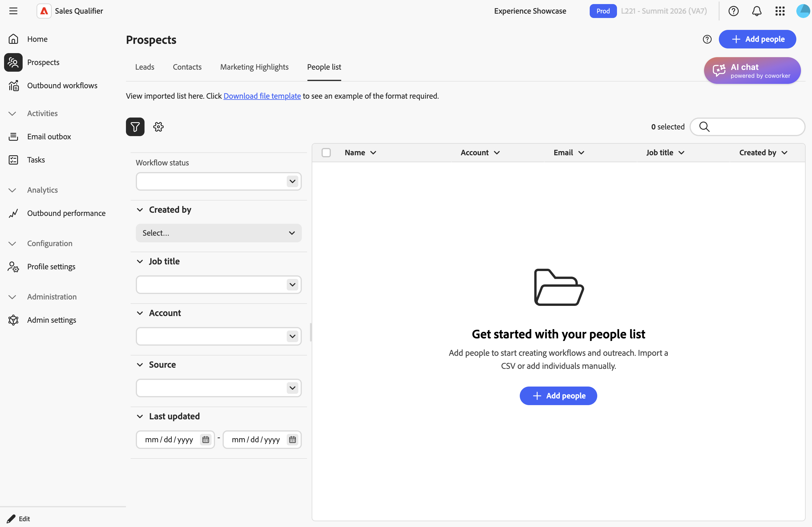

# Prospects

Sélectionnez **[!UICONTROL Prospects]** dans le volet de navigation de gauche pour afficher les prospects et les contacts auxquels vous pouvez accéder. Utilisez la liste pour consulter le statut de chaque prospect et sa dernière activité.

{width="800" zoomable="yes"}

* **[!UICONTROL Leads]** : leads qui vous sont affectés dans le CRM connecté.
* **[!UICONTROL Contacts]**—Contacts qui vous sont assignés dans le CRM connecté.
* **[!UICONTROL Points forts marketing]** : prospects disposant d’une activité Marketo en direct, telle que les ouvertures d’e-mail ou les clics.
* **[!UICONTROL Liste des personnes]** : prospects que vous importez ou ajoutez manuellement.

## Création de votre liste de prospects

La liste des prospects regroupe des personnes provenant de plusieurs sources :

* **Prospects CRM** : Sales Qualifier importe automatiquement les leads et les contacts attribués à l’utilisateur connecté. Pour plus d&#39;informations, consultez la section [ Intégrations ](integrations.md).
* **Prospects importés**—Prospects importés à partir d&#39;un fichier CSV.
* **Prospects ajoutés manuellement**—Prospects ajoutés individuellement dans Sales Qualifier.

Pour ajouter des prospects qui ne proviennent pas de votre CRM :

1. Sur la page **[!UICONTROL Prospects]**, sélectionnez **[!UICONTROL Liste des personnes]**.

   {width="800" zoomable="yes"}

1. Sélectionnez **[!UICONTROL + Ajouter des personnes]** puis sélectionnez **[!UICONTROL Importer CSV]** ou **[!UICONTROL Ajouter une personne]**.

   * Pour un import CSV, chargez un fichier CSV au format `firstname,email`.
     Vous devez indiquer votre prénom et votre adresse e-mail. Le nom est facultatif. Le modèle CSV n’inclut pas la colonne d’ID de prospect CRM, mais vous pouvez ajouter la colonne et ses valeurs au fichier avant l’importation. Si l’importation échoue, consultez le message d’erreur pour les champs ou valeurs à corriger, puis chargez à nouveau le fichier.
     Mappez tous les champs CSV personnalisés ou supplémentaires, et pas seulement les champs standard. Sales Qualifier enregistre ces valeurs pour chaque prospect et les rend disponibles ultérieurement, y compris pour la [ génération d’e-mails](outbound-workflows.md#step-5-add-prospects-and-start-email-generation).
   * Pour ajouter une personne manuellement, saisissez ses détails dans le formulaire.

1. Sélectionnez **[!UICONTROL Enregistrer]**.

## Filtrer et rechercher des prospects

Sélectionnez **[!UICONTROL Filtrer]** pour affiner la liste. Vous pouvez filtrer par :

* Statut du workflow sortant
* Création par
* Titre du traitement
* Compte
* Source
* Dernière mise à jour

Les administrateurs peuvent également rendre les champs CRM mappés disponibles en tant que filtres. Dans **[!UICONTROL Paramètres d’administration]**, activez **[!UICONTROL Filtrable]** pour chaque champ que les représentants utilisent pour rechercher des prospects. Voir [ Mappage des champs CRM ](integrations.md#map-crm-fields-inbound-mapping).

Dans **[!UICONTROL Mes contacts d’opportunité]**, vous pouvez également filtrer les contacts par champs à partir des opportunités associées, telles que l’étape, le type et la date de fermeture. Les champs d’opportunité comportent des libellés tels que **[!UICONTROL Phase (Opportunité)]** qui les distinguent des champs de contact. Votre administrateur contrôle les champs d’opportunité disponibles en tant que filtres.

### Filtrer par points forts marketing

Recherchez et hiérarchisez les prospects en fonction de leur engagement dans les [!DNL Marketo] en direct, tel que les ouvertures d’e-mail et les clics, les visites web, les remplissages de formulaires et les moments intéressants. L’engagement apparaît en temps quasi réel, comme cela se produit.

Pour filtrer les prospects par points forts marketing :

1. Sélectionnez **[!UICONTROL Filtrer]**.
1. Ajoutez un filtre Points forts marketing et définissez le type d’activité, la campagne ou d’autres attributs pour vous concentrer sur l’engagement qui compte.

Chaque prospect montre sa dernière activité [!DNL Marketo] ainsi que son historique récent.

L’option Points forts marketing est disponible dans toutes les régions de production. Un administrateur effectue une configuration unique qui connecte [!DNL Marketo] à Sales Qualifier. Voir [Configurer les points forts marketing](integrations.md#turn-on-marketo-engagement-filtering).

## Consulter les détails du prospect

Sélectionnez un prospect pour ouvrir son profil. Examinez les signaux qui comptent avant de vous adresser à :

* **Résumé de personne par IA** : instantané écrit par IA du prospect ou du contact et de son engagement récent. Utilisez le résumé pour comprendre la personne en un coup d’œil avant de passer en revue les activités individuelles. Les résumés des personnes par IA sont disponibles sur les instances exécutant Adobe Journey Optimizer B2B edition Prime ou Ultimate.
* **Liste des activités**—Liste chronologique des activités et des comportements récents.
* **Vue Chronologie** : chronologie visuelle de l’engagement sur plusieurs canaux.
* **Contenu affiché** : pages Web et ressources consultées par le prospect. Sélectionnez un élément pour l’ouvrir.

### Générer la préparation de la réunion

Outre le résumé de la personne IA permanente, vous pouvez générer une préparation de réunion adaptée à un appel à venir spécifique à partir de l’onglet **[!UICONTROL Recherche de réunion]** en regard de **[!UICONTROL Recherche de compte]**.

* **Basé sur un objectif** : si le prospect est inscrit à un workflow sortant en cours d’exécution, sélectionnez-le. La préparation correspond à l’objectif de ce workflow sortant, tel que la réservation d’une réunion, un argumentaire de produit, une invitation à un événement ou le réengagement du prospect.
* **Invite personnalisée**—Saisissez ce pour quoi vous souhaitez vous préparer, par exemple `Focus on renewal risk` ou `Prepare for a technical deep dive with their IT lead`. La préparation correspond à votre invite. L’option d’invite personnalisée est disponible lorsque le prospect ne se trouve pas dans un workflow sortant en cours d’exécution.

>[!MORELIKETHIS]
>
>* [Comptes](accounts.md)
>* [Workflows sortants](outbound-workflows.md)
>* [Conversation IA](ai-assistant.md)
